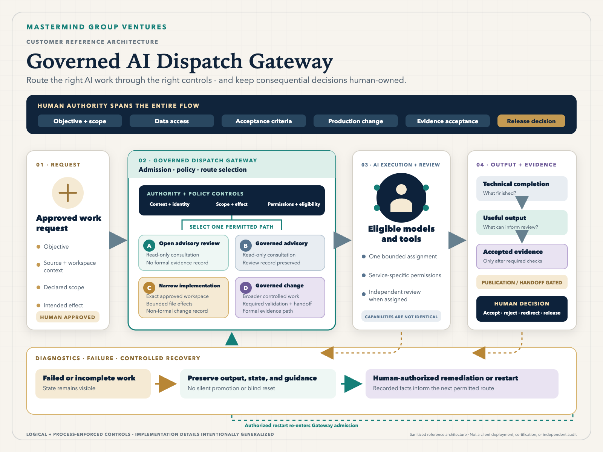

# Selected AI Product Work

Two public case studies showing how I turn complex business needs into products and system designs that people can use. These summaries do not include private source code, customer material, or internal operating procedures.

## DNA Health Insights

A live consumer genomics education platform that turns uploaded DNA data into source-linked, plain-language reports. My work spans the customer experience, report creation, guided support, payments, dashboards, testing, and day-to-day product ownership.

[Read the DNA Health Insights case study](case-studies/dna-health-insights.md)  
[Visit the live product](https://www.dna-health-insights.com/)

## Keeping AI Work Within Human-Approved Boundaries

A customer reference architecture for teams using several AI models or tools while keeping important decisions, access, evidence acceptance, and release authority with people.

[Read the reference-architecture case study](case-studies/human-approved-ai-work.md)

## Runnable Example

[Connected Report Demo](https://github.com/adolphwhite7/connected-report-demo) reads a small set of synthetic findings and writes one connected Markdown report with source links.

## About

Created by [Adolph White Jr.](https://github.com/adolphwhite7), Chief Architect of DNA Health Insights and Founder of Mastermind Group Ventures.
